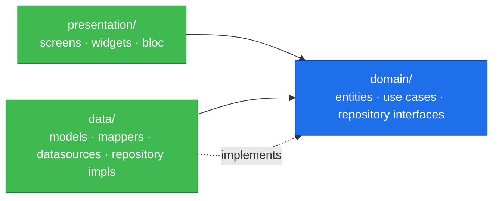

# Flutter — folder structure best practices

> **Vendored reference.** Copied from the owner's personal notes
> (`software-engineering/mobile/flutter/`), links rewritten for this repo.
> General Flutter guidance the project follows; kept in sync manually. See the
> [Flutter reference index](./README.md).

## 📋 Overview

A well-organized folder structure is crucial for maintainability, scalability, and team collaboration. This guide covers industry-standard Flutter project structures, from simple apps to complex enterprise applications.

> [!info] Key Principle
> Your folder structure should reflect your architecture and make it easy to locate, modify, and test code. Choose a structure that scales with your project's complexity.

## 🎯 Choosing the Right Structure

### Project Complexity Levels

| Complexity | Project Size | Recommended Structure |
|------------|-------------|----------------------|
| **Simple** | < 10 screens, basic features | Feature-First (Flat) |
| **Medium** | 10-30 screens, moderate complexity | Layer-First or Feature-First |
| **Complex** | 30+ screens, multiple features | Clean Architecture |
| **Enterprise** | Large team, multiple modules | Clean Architecture + Feature Modules |

## 🏗️ Architecture Patterns

### 1. Simple/Flat Structure

**Best for**: Small apps, prototypes, learning projects

```
lib/
├── main.dart
├── models/
│   ├── user.dart
│   └── product.dart
├── screens/
│   ├── home_screen.dart
│   ├── detail_screen.dart
│   └── profile_screen.dart
├── widgets/
│   ├── custom_button.dart
│   └── product_card.dart
├── services/
│   ├── api_service.dart
│   └── auth_service.dart
└── utils/
    ├── constants.dart
    └── helpers.dart
```

**Pros:**
- Easy to understand
- Quick to navigate
- Good for learning

**Cons:**
- Doesn't scale well
- Hard to maintain as app grows
- Difficult to test properly

### 2. Layer-First (MVC/MVVM) Structure

**Best for**: Medium-sized apps with clear separation of concerns

```
lib/
├── main.dart
├── config/
│   ├── routes.dart
│   └── theme.dart
├── models/              # Data models
│   ├── user_model.dart
│   └── product_model.dart
├── views/               # UI screens
│   ├── home/
│   │   ├── home_view.dart
│   │   └── widgets/
│   │       └── home_header.dart
│   └── profile/
│       └── profile_view.dart
├── controllers/         # Business logic (or view_models)
│   ├── home_controller.dart
│   └── profile_controller.dart
├── services/           # External services
│   ├── api_service.dart
│   ├── auth_service.dart
│   └── storage_service.dart
├── repositories/       # Data access layer
│   ├── user_repository.dart
│   └── product_repository.dart
├── widgets/            # Reusable widgets
│   ├── buttons/
│   │   └── primary_button.dart
│   └── cards/
│       └── product_card.dart
├── utils/
│   ├── constants.dart
│   ├── helpers.dart
│   └── validators.dart
└── core/               # Core utilities
    ├── errors/
    └── network/
```

**Pros:**
- Clear separation by technical layer
- Easy to find files by type
- Good for traditional architectures

**Cons:**
- Features are spread across multiple folders
- Hard to isolate and reuse features

### 3. Feature-First Structure

**Best for**: Apps with distinct, independent features

```
lib/
├── main.dart
├── core/                    # Shared across all features
│   ├── config/
│   │   ├── routes.dart
│   │   └── theme.dart
│   ├── constants/
│   │   └── app_constants.dart
│   ├── errors/
│   │   ├── exceptions.dart
│   │   └── failures.dart
│   ├── network/
│   │   ├── api_client.dart
│   │   └── dio_interceptor.dart
│   ├── utils/
│   │   └── validators.dart
│   └── widgets/             # Shared widgets
│       ├── buttons/
│       └── loading_indicator.dart
│
├── features/
│   ├── authentication/
│   │   ├── data/
│   │   │   ├── models/
│   │   │   ├── repositories/
│   │   │   └── datasources/
│   │   ├── domain/
│   │   │   ├── entities/
│   │   │   ├── repositories/
│   │   │   └── usecases/
│   │   └── presentation/
│   │       ├── pages/
│   │       ├── widgets/
│   │       └── bloc/
│   │
│   ├── home/
│   │   ├── data/
│   │   ├── domain/
│   │   └── presentation/
│   │
│   └── profile/
│       ├── data/
│       ├── domain/
│       └── presentation/
│
└── shared/                  # Shared between some features
    ├── models/
    └── widgets/
```

**Pros:**
- Features are self-contained
- Easy to add/remove features
- Good for modular development
- Teams can work independently

**Cons:**
- Some code duplication
- Need to decide what's shared vs feature-specific

### 4. Clean Architecture Structure ⭐ (Recommended)

**Best for**: Complex apps requiring scalability and testability

This is the structure used in the learning project at `/Users/alami/Documents/Learn/flutter/pin_offline_flutter`

```
lib/
├── main.dart                # App entry point
├── app.dart                 # App configuration
│
├── core/                    # Core infrastructure
│   ├── config/
│   │   └── app_config.dart
│   ├── constant/
│   │   └── date_time_format.dart
│   ├── di/                  # Dependency Injection
│   │   ├── inject_dependencies.dart
│   │   └── modules/
│   │       ├── auth/
│   │       │   ├── auth_di.dart
│   │       │   └── index.dart          # Barrel file
│   │       └── outlet/
│   │           ├── outlet_di.dart
│   │           └── index.dart          # Barrel file
│   ├── errors/
│   │   ├── exceptions.dart
│   │   ├── failures.dart
│   │   └── index.dart                  # Barrel file
│   ├── network/
│   │   ├── api_service.dart
│   │   ├── dio_interceptor.dart
│   │   ├── network_config.dart
│   │   └── index.dart                  # Barrel file
│   ├── services/            # Shared services
│   │   ├── auth_service.dart
│   │   └── index.dart                  # Barrel file
│   ├── storage/
│   │   ├── secure_storage.dart
│   │   ├── storage_keys.dart
│   │   └── index.dart                  # Barrel file
│   ├── theme/
│   │   ├── colors.dart
│   │   └── index.dart                  # Barrel file
│   └── utils/
│       ├── safe_api_call.dart
│       └── index.dart                  # Barrel file
│
├── data/                    # Data Layer
│   ├── datasources/
│   │   ├── local/
│   │   │   ├── auth_local_data_source.dart
│   │   │   ├── user_local_data_source.dart
│   │   │   └── index.dart              # Barrel file
│   │   └── remote/
│   │       ├── auth_remote_data_source.dart
│   │       ├── outlet_remote_data_source.dart
│   │       └── index.dart              # Barrel file
│   ├── mappers/             # DTO to Entity mapping
│   │   ├── user_mapper.dart
│   │   ├── outlet_mapper.dart
│   │   └── index.dart                  # Barrel file
│   ├── models/              # Data Transfer Objects (DTOs)
│   │   ├── auth/
│   │   │   ├── login_request_model.dart
│   │   │   ├── login_response_model.dart
│   │   │   └── index.dart              # Barrel file
│   │   ├── outlet/
│   │   │   ├── outlet_model.dart
│   │   │   └── index.dart              # Barrel file
│   │   └── api_response.dart
│   ├── providers/           # State management providers
│   │   └── auth_provider.dart
│   └── repositories/        # Repository implementations
│       ├── auth_repository_impl.dart
│       ├── user_repository_impl.dart
│       ├── outlet_repository_impl.dart
│       └── index.dart                  # Barrel file
│
├── domain/                  # Domain Layer (Business Logic)
│   ├── entities/            # Business entities
│   │   ├── user_data.dart
│   │   ├── outlet_group.dart
│   │   └── index.dart                  # Barrel file
│   ├── repositories/        # Repository interfaces
│   │   ├── auth_repository.dart
│   │   ├── user_repository.dart
│   │   ├── outlet_repository.dart
│   │   └── index.dart                  # Barrel file
│   └── usecases/           # Business use cases
│       ├── auth/
│       │   ├── login_usecase.dart
│       │   ├── logout_usecase.dart
│       │   ├── user_usecase.dart
│       │   └── index.dart              # Barrel file
│       └── outlet/
│           ├── get_outlet_list_usecase.dart
│           └── index.dart              # Barrel file
│
├── presentation/            # Presentation Layer (UI)
│   ├── bloc/                # State management (BLoC)
│   │   ├── auth/
│   │   │   ├── auth_bloc.dart
│   │   │   ├── auth_event.dart
│   │   │   ├── auth_state.dart
│   │   │   └── index.dart              # Barrel file
│   │   ├── outlet/
│   │   │   ├── outlet_bloc.dart
│   │   │   ├── outlet_event.dart
│   │   │   ├── outlet_state.dart
│   │   │   └── index.dart              # Barrel file
│   │   └── user/
│   │       ├── user_bloc.dart
│   │       ├── user_event.dart
│   │       ├── user_state.dart
│   │       └── index.dart              # Barrel file
│   ├── navigation/
│   │   └── app_router.dart
│   ├── screens/            # Full screen pages (flat structure)
│   │   ├── login_screen.dart
│   │   ├── home_screen.dart
│   │   ├── sync_data_screen.dart
│   │   ├── change_host_screen.dart
│   │   └── index.dart                  # Barrel file
│   └── widgets/            # Reusable UI components
│       ├── common/
│       │   ├── button.dart
│       │   ├── input.dart
│       │   ├── header.dart
│       │   ├── app_card.dart
│       │   ├── app_typography.dart
│       │   ├── skeleton_loading.dart
│       │   └── index.dart              # Barrel file
│       └── home/
│           ├── outlet_card.dart
│           └── index.dart              # Barrel file
│
└── gen/                    # Generated code
    ├── assets.gen.dart
    └── fonts.gen.dart
```

> [!tip] Real-World Example
> The structure above is from an actual Flutter project. It follows Clean Architecture principles with clear separation between data, domain, and presentation layers.

> [!info] Screens Organization
> Notice that screens are kept at a flat level (`presentation/screens/`) rather than in feature subfolders. This is practical when you have one screen per file - adding a folder for a single file is unnecessary. If a screen grows and needs multiple related files (like screen-specific widgets or controllers), you can then create a subfolder for it.

> [!info] Barrel Files (index.dart)
> Barrel files are used throughout to simplify imports. For example, instead of importing multiple files from the auth BLoC, you can just import from `presentation/bloc/auth/index.dart` which exports all auth-related files.

### The Dependency Rule (visualised)

Clean Architecture's whole point is the direction of dependencies: **outer layers depend on inner layers, never the other way around.** Domain sits at the centre and knows nothing about Flutter, Dio, drift, or any framework.



**Concrete consequence**: a file under `domain/` must NOT import `package:flutter/material.dart`, `package:dio/...`, or `package:drift/...`. If it needs to, the abstraction is wrong — extract an interface.

The compiler can't enforce this for you, but a quick `grep` in CI can:

```bash
# fail the build if anything in domain/ imports framework code
! grep -r "package:flutter/\|package:dio/\|package:drift/" lib/domain/
```

### Clean Architecture Layers Explained

#### 1. **Core Layer**
Infrastructure and utilities shared across the entire app.

```dart
// core/network/api_service.dart
	class ApiService {
  final Dio _dio;

  ApiService(this._dio);

  Future<Response> get(String path) async {
    return await _dio.get(path);
  }
}

// core/errors/failures.dart
abstract class Failure {
  final String message;
  const Failure(this.message);
}

class ServerFailure extends Failure {
  const ServerFailure(super.message);
}

class NetworkFailure extends Failure {
  const NetworkFailure(super.message);
}
```

#### 2. **Domain Layer** (Business Logic)

Pure Dart, no dependencies on Flutter or external packages.

```dart
// domain/entities/user.dart
class User {
  final String id;
  final String name;
  final String email;

  const User({
    required this.id,
    required this.name,
    required this.email,
  });
}

// domain/repositories/auth_repository.dart (Interface)
abstract class AuthRepository {
  Future<Either<Failure, User>> login(String email, String password);
  Future<Either<Failure, void>> logout();
}

// domain/usecases/auth/login_usecase.dart
class LoginUseCase {
  final AuthRepository repository;

  LoginUseCase(this.repository);

  Future<Either<Failure, User>> call(String email, String password) {
    return repository.login(email, password);
  }
}
```

#### 3. **Data Layer** (Data Access)

Implements domain repositories and handles data sources.

```dart
// data/models/auth/login_response_model.dart (DTO)
class LoginResponseModel {
  final String id;
  final String name;
  final String email;

  LoginResponseModel({
    required this.id,
    required this.name,
    required this.email,
  });

  factory LoginResponseModel.fromJson(Map<String, dynamic> json) {
    return LoginResponseModel(
      id: json['id'],
      name: json['name'],
      email: json['email'],
    );
  }

  // Convert to domain entity
  User toEntity() {
    return User(id: id, name: name, email: email);
  }
}

// data/datasources/remote/auth_remote_data_source.dart
abstract class AuthRemoteDataSource {
  Future<LoginResponseModel> login(String email, String password);
}

class AuthRemoteDataSourceImpl implements AuthRemoteDataSource {
  final ApiService apiService;

  AuthRemoteDataSourceImpl(this.apiService);

  @override
  Future<LoginResponseModel> login(String email, String password) async {
    final response = await apiService.post('/auth/login', {
      'email': email,
      'password': password,
    });

    return LoginResponseModel.fromJson(response.data);
  }
}

// data/repositories/auth_repository_impl.dart
class AuthRepositoryImpl implements AuthRepository {
  final AuthRemoteDataSource remoteDataSource;
  final AuthLocalDataSource localDataSource;

  AuthRepositoryImpl(this.remoteDataSource, this.localDataSource);

  @override
  Future<Either<Failure, User>> login(String email, String password) async {
    try {
      final result = await remoteDataSource.login(email, password);
      final user = result.toEntity();
      await localDataSource.cacheUser(user);
      return Right(user);
    } on ServerException catch (e) {
      return Left(ServerFailure(e.message));
    } on NetworkException {
      return Left(NetworkFailure('No internet connection'));
    }
  }
}
```

#### 4. **Presentation Layer** (UI)

Handles UI, state management, and user interactions.

> [!tip] Two patterns for state classes — pick one and stick to it
> Older Flutter projects use `abstract class XxxState {}` + concrete subclasses (shown below). With Dart 3, you can replace this with **`sealed class`** for compile-time-exhaustive `switch` statements, or with **`freezed`** for boilerplate-free unions. Sealed classes are the modern default.
>
> ```dart
> // Option A — Dart 3 sealed class (no codegen)
> sealed class AuthState {}
> final class AuthInitial extends AuthState {}
> final class AuthLoading extends AuthState {}
> final class AuthSuccess extends AuthState { final User user; AuthSuccess(this.user); }
> final class AuthError   extends AuthState { final String message; AuthError(this.message); }
>
> // In the UI: switch is exhaustive at compile time
> Widget build(BuildContext context) => switch (state) {
>   AuthInitial()        => const SizedBox.shrink(),
>   AuthLoading()        => const CircularProgressIndicator(),
>   AuthSuccess(:final user) => Text('Welcome, ${user.name}'),
>   AuthError(:final message) => Text('Error: $message'),
> };
> ```
>
> ```dart
> // Option B — freezed (codegen, less boilerplate, copyWith for free)
> @freezed
> sealed class AuthState with _$AuthState {
>   const factory AuthState.initial() = AuthInitial;
>   const factory AuthState.loading() = AuthLoading;
>   const factory AuthState.success(User user) = AuthSuccess;
>   const factory AuthState.error(String message) = AuthError;
> }
> ```

```dart
// presentation/bloc/auth/auth_event.dart
abstract class AuthEvent {}

class LoginRequested extends AuthEvent {
  final String email;
  final String password;

  LoginRequested(this.email, this.password);
}

// presentation/bloc/auth/auth_state.dart
abstract class AuthState {}

class AuthInitial extends AuthState {}
class AuthLoading extends AuthState {}
class AuthSuccess extends AuthState {
  final User user;
  AuthSuccess(this.user);
}
class AuthError extends AuthState {
  final String message;
  AuthError(this.message);
}

// presentation/bloc/auth/auth_bloc.dart
class AuthBloc extends Bloc<AuthEvent, AuthState> {
  final LoginUseCase loginUseCase;

  AuthBloc(this.loginUseCase) : super(AuthInitial()) {
    on<LoginRequested>(_onLoginRequested);
  }

  Future<void> _onLoginRequested(
    LoginRequested event,
    Emitter<AuthState> emit,
  ) async {
    emit(AuthLoading());

    final result = await loginUseCase(event.email, event.password);

    result.fold(
      (failure) => emit(AuthError(failure.message)),
      (user) => emit(AuthSuccess(user)),
    );
  }
}

// presentation/screens/login/login_screen.dart
class LoginScreen extends StatelessWidget {
  @override
  Widget build(BuildContext context) {
    return BlocProvider(
      create: (context) => getIt<AuthBloc>(),
      child: Scaffold(
        body: BlocBuilder<AuthBloc, AuthState>(
          builder: (context, state) {
            if (state is AuthLoading) {
              return Center(child: CircularProgressIndicator());
            }

            if (state is AuthError) {
              return Text('Error: ${state.message}');
            }

            return LoginForm();
          },
        ),
      ),
    );
  }
}
```

## 📝 File Naming Conventions

### General Rules

```
✅ CORRECT                           ❌ WRONG
────────────────────────────────────────────────────────
user_repository.dart                UserRepository.dart
login_screen.dart                   LoginScreen.dart
custom_button.dart                  CustomButton.dart
auth_bloc.dart                      authBloc.dart
product_card_widget.dart            ProductCardWidget.dart
```

**Rules:**
- Use **snake_case** for file names
- Use **PascalCase** for class names
- File name should match the main class name (in snake_case)

```dart
// ✅ File: login_screen.dart
class LoginScreen extends StatelessWidget { }

// ✅ File: user_repository.dart
class UserRepository { }

// ✅ File: auth_bloc.dart
class AuthBloc extends Bloc { }
```

### Naming by Type

| Type | Naming Pattern | Example |
|------|---------------|---------|
| **Screens/Pages** | `{feature}_screen.dart` | `login_screen.dart` |
| **Widgets** | `{name}_widget.dart` or `{name}.dart` | `product_card.dart` |
| **Models** | `{name}_model.dart` | `user_model.dart` |
| **Repositories** | `{name}_repository.dart` | `auth_repository.dart` |
| **Services** | `{name}_service.dart` | `api_service.dart` |
| **Use Cases** | `{action}_usecase.dart` | `login_usecase.dart` |
| **BLoC** | `{feature}_bloc.dart` | `auth_bloc.dart` |
| **Events** | `{feature}_event.dart` | `auth_event.dart` |
| **States** | `{feature}_state.dart` | `auth_state.dart` |
| **Constants** | `{category}_constants.dart` | `app_constants.dart` |

## 🗂️ Folder Organization Guidelines

### 1. Keep Related Files Together

```
✅ GOOD - Grouped by feature
features/
  auth/
    bloc/
      auth_bloc.dart
      auth_event.dart
      auth_state.dart
    screens/
      login_screen.dart
    widgets/
      login_form.dart

❌ BAD - Scattered across folders
bloc/
  auth_bloc.dart
  auth_event.dart
screens/
  login_screen.dart
widgets/
  login_form.dart
```

### 2. Use Barrel Files (index.dart)

Export multiple files from a folder using `index.dart` to simplify imports:

#### Barrel File Examples from Clean Architecture

**BLoC Barrel File:**
```dart
// presentation/bloc/auth/index.dart
export 'auth_bloc.dart';
export 'auth_event.dart';
export 'auth_state.dart';

// Usage in screens
import 'package:my_app/presentation/bloc/auth/index.dart';
// Now you can use: AuthBloc, AuthEvent, AuthState, LoginRequested, etc.

// Instead of:
// import 'package:my_app/presentation/bloc/auth/auth_bloc.dart';
// import 'package:my_app/presentation/bloc/auth/auth_event.dart';
// import 'package:my_app/presentation/bloc/auth/auth_state.dart';
```

**Domain Layer Barrel Files:**
```dart
// domain/entities/index.dart
export 'user_data.dart';
export 'outlet_group.dart';

// domain/repositories/index.dart
export 'auth_repository.dart';
export 'user_repository.dart';
export 'outlet_repository.dart';

// domain/usecases/auth/index.dart
export 'login_usecase.dart';
export 'logout_usecase.dart';
export 'user_usecase.dart';

// Usage
import 'package:my_app/domain/entities/index.dart';
import 'package:my_app/domain/repositories/index.dart';
import 'package:my_app/domain/usecases/auth/index.dart';
```

#### Before vs After Comparison

**❌ Without Barrel Files (Messy):**
```dart
// login_screen.dart
import 'package:my_app/presentation/bloc/auth/auth_bloc.dart';
import 'package:my_app/presentation/bloc/auth/auth_event.dart';
import 'package:my_app/presentation/bloc/auth/auth_state.dart';
import 'package:my_app/presentation/widgets/common/button.dart';
import 'package:my_app/presentation/widgets/common/input.dart';
import 'package:my_app/core/errors/failures.dart';
import 'package:my_app/domain/entities/user_data.dart';
```

**✅ With Barrel Files (Clean):**
```dart
// login_screen.dart
import 'package:my_app/presentation/bloc/auth/index.dart';
import 'package:my_app/presentation/widgets/common/index.dart';
import 'package:my_app/core/errors/index.dart';
import 'package:my_app/domain/entities/index.dart';
```

> [!tip] Barrel File Benefits
> - **Cleaner imports**: Reduce import lines by 60-70%
> - **Easier refactoring**: Move files around without updating many imports
> - **Clear public API**: Shows what's meant to be used from a module
> - **Better organization**: Group related exports together

> [!warning] Barrel File Caution
> While barrel files reduce import clutter, they can slightly increase bundle size if you import unused exports. Use them for:
> - ✅ Public APIs (BLoCs, use cases, repositories)
> - ✅ Widget libraries (common components)
> - ✅ Feature modules
> - ❌ Avoid for: Very large files with many unused exports

### 3. Separate Concerns

```dart
// ✅ GOOD - Single responsibility
// auth_validator.dart
class AuthValidator {
  static String? validateEmail(String email) { }
}

// auth_service.dart
class AuthService {
  Future<User> login(String email, String password) { }
}

// ❌ BAD - Mixed concerns
// auth_utils.dart
class AuthUtils {
  static String? validateEmail(String email) { }
  Future<User> login(String email, String password) { }
  void showLoginError(BuildContext context) { }
}
```

### 4. Group Assets Logically

```
assets/
├── images/
│   ├── icons/
│   │   ├── home.png
│   │   └── profile.png
│   ├── logos/
│   │   └── app_logo.png
│   └── backgrounds/
│       └── splash_bg.png
├── fonts/
│   ├── Roboto-Regular.ttf
│   └── Roboto-Bold.ttf
└── translations/
    ├── en.json
    └── id.json
```

## 🎨 Common Patterns

### Pattern 1: Feature Module Structure

```
features/
  user_profile/
    data/
      models/
        profile_model.dart
      repositories/
        profile_repository_impl.dart
      datasources/
        profile_remote_datasource.dart
    domain/
      entities/
        profile.dart
      repositories/
        profile_repository.dart
      usecases/
        get_profile_usecase.dart
        update_profile_usecase.dart
    presentation/
      bloc/
        profile_bloc.dart
        profile_event.dart
        profile_state.dart
      screens/
        profile_screen.dart
      widgets/
        profile_header.dart
        profile_stats.dart
```

### Pattern 2: Shared Module

```
shared/
  data/
    models/
      api_response.dart
  domain/
    entities/
      result.dart
  presentation/
    widgets/
      loading_overlay.dart
      error_dialog.dart
```

### Pattern 3: Config Module

```
core/
  config/
    app_config.dart          # Environment config
    routes.dart              # App routes
    theme.dart              # App theme
    localization.dart       # i18n config
  constants/
    api_constants.dart
    app_constants.dart
    storage_keys.dart
```

## 🧪 Test Folder Structure

Three top-level test trees — `test/`, `test/goldens/`, `integration_test/` — each with a different purpose.

```
project_root/
├── lib/
├── test/                          # unit + widget + bloc tests (mirrors lib/)
│   ├── core/
│   │   ├── network/
│   │   │   └── api_service_test.dart
│   │   └── utils/
│   │       └── validators_test.dart
│   ├── data/
│   │   ├── models/
│   │   │   └── user_model_test.dart
│   │   ├── mappers/
│   │   │   └── user_mapper_test.dart
│   │   └── repositories/
│   │       └── auth_repository_impl_test.dart
│   ├── domain/
│   │   └── usecases/
│   │       └── login_usecase_test.dart
│   ├── presentation/
│   │   ├── bloc/
│   │   │   └── auth_bloc_test.dart
│   │   └── widgets/
│   │       └── login_form_test.dart
│   └── goldens/                   # alchemist baselines (PNG files)
│       ├── auth/
│       │   ├── login_screen.png
│       │   └── login_screen_loading.png
│       └── transaction/
│           └── transactions_screen.png
└── integration_test/              # full-app E2E flows
    ├── app_test.dart
    └── critical_flows/
        ├── login_flow_test.dart
        └── add_transaction_flow_test.dart
```

**Naming Convention:**
- Unit / widget tests: `{original_file}_test.dart` (e.g. `auth_bloc.dart` → `auth_bloc_test.dart`)
- Golden test files: `{screen}_golden_test.dart` (kept inside `test/`); baselines live in `test/goldens/<feature>/`
- Integration tests: `{flow}_flow_test.dart`

**Golden test workflow:**
- Generate / update baselines: `flutter test --update-goldens`
- Run validation: `flutter test` — fails if rendering diverges from `test/goldens/`
- Always commit `test/goldens/*.png` to git so CI has a reference
- Never run `--update-goldens` on a dirty branch — the baseline becomes whatever the buggy code produces

**Integration test workflow:**
- Run on a real device or emulator: `flutter test integration_test/`
- Each `*_flow_test.dart` exercises one critical user path end-to-end (auth, add transaction, etc.) — keep these focused; they're slow

> [!info] Why three trees?
> `test/` runs in seconds and gates every commit. `test/goldens/` catches visual regressions cheaply but only when you opt in to the workflow. `integration_test/` runs only on demand (or on a nightly CI job) because it boots the whole app — you don't want it gating every PR.

## 💡 Best Practices

### ✅ Do's

1. **Group by feature or layer** - Choose one approach and stick to it
2. **Keep files small** - Split large files into smaller, focused ones
3. **Use meaningful names** - Names should describe purpose clearly
4. **Organize imports** - Group Dart, Flutter, Package, and Local imports
5. **Create shared folders** - For truly shared code across features
6. **Document structure** - Add README in complex folders

```dart
// ✅ GOOD - Organized imports
// Dart imports
import 'dart:async';
import 'dart:convert';

// Flutter imports
import 'package:flutter/material.dart';

// Package imports
import 'package:provider/provider.dart';
import 'package:http/http.dart';

// Local imports
import '../models/user.dart';
import '../services/auth_service.dart';
```

### ❌ Don'ts

1. **Don't mix layers** - Keep presentation, domain, and data separate
2. **Don't create deep nesting** - Max 3-4 levels deep
3. **Don't duplicate code** - Extract to shared if used in 3+ places
4. **Don't ignore conventions** - Follow established team patterns
5. **Don't over-engineer** - Start simple, refactor as needed

## 🔄 Migration Strategy

### From Flat to Clean Architecture

```
Step 1: Create folder structure
  ├── core/
  ├── data/
  ├── domain/
  └── presentation/

Step 2: Move models to data/models/

Step 3: Extract entities to domain/entities/

Step 4: Create repository interfaces in domain/repositories/

Step 5: Implement repositories in data/repositories/

Step 6: Extract use cases to domain/usecases/

Step 7: Move screens to presentation/screens/

Step 8: Move widgets to presentation/widgets/

Step 9: Set up state management in presentation/bloc/

Step 10: Configure DI in core/di/
```

## 🔗 Related Notes

- [Flutter Architecture and Core Concepts](./flutter-architecture.md)
- [Flutter States and Lifecycle](./flutter-state-lifecycle.md)
- [Flutter Best Practices](./flutter-best-practices.md) 

## 📚 Further Reading

- [Flutter Style Guide](https://flutter.dev/docs/development/tools/formatting)
- [Effective Dart](https://dart.dev/guides/language/effective-dart)
- [Clean Architecture by Uncle Bob](https://blog.cleancoder.com/uncle-bob/2012/08/13/the-clean-architecture.html)
- [Flutter Architecture Samples](https://github.com/brianegan/flutter_architecture_samples)

---

**Last Updated**: 2026-05-09
**Learning Project**: `/Users/alami/Documents/Learn/flutter/pin_offline_flutter`
**Reference Project**: [Sakinah Wallet](../../../plans/in-progress/00-overview.md) — sharia-finance Flutter app applying these conventions
**Project Structure**: Clean Architecture with BLoC
