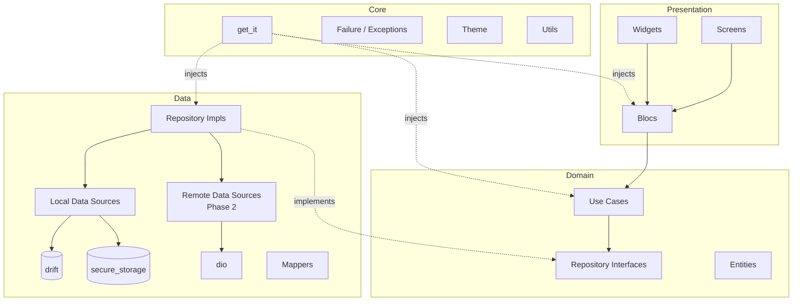
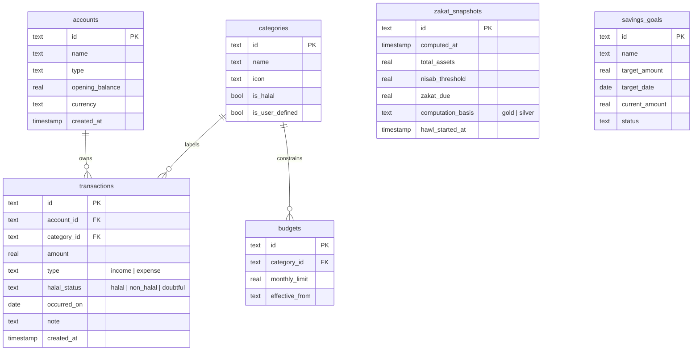
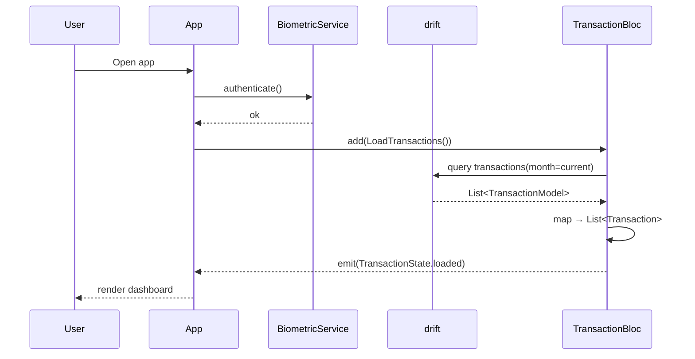
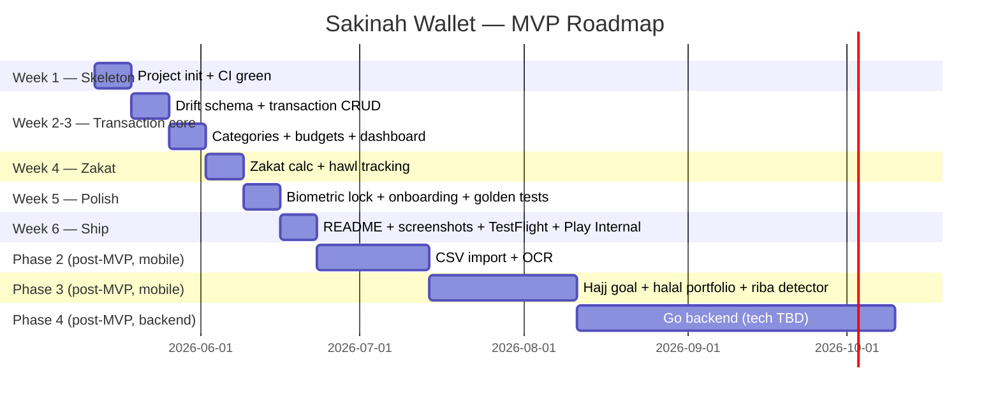

# Plan 00 — Sakinah Wallet: Project Overview & Roadmap

> [!info] Project Purpose
> Mobile-first sharia-finance learning + portfolio project. **Flutter-only MVP** (local-first, no backend), with a **Go backend** planned post-MVP as a deliberate second-language learning track. Deliberately scoped smaller than FinSplit — Sakinah Wallet is the "go deep on Flutter + Go" project; FinSplit is the "go wide on full-stack with Java" project.

## TL;DR

| Item                | Detail                                                                              |
| ------------------- | ----------------------------------------------------------------------------------- |
| **Project**         | Sharia-compliant personal finance app — budgeting, zakat, hajj savings, halal flag  |
| **Differentiator**  | Built-in zakat calculator with hawl tracking, halal/non-halal categorisation, riba detector (post-MVP) |
| **Target users**    | Muslim solo earners, family budgeters, hajj-saving aspirants                        |
| **MVP platform**    | Flutter (iOS + Android), local-first, no backend                                    |
| **Architecture**    | Clean Architecture (`core` / `data` / `domain` / `presentation`)                    |
| **State**           | `flutter_bloc` (Bloc + Cubit triplet)                                               |
| **DI**              | `get_it` with per-feature `*_di.dart` modules                                       |
| **Local DB**        | `drift` (type-safe SQL)                                                             |
| **Sensitive store** | `flutter_secure_storage`                                                            |
| **Routing**         | `go_router`                                                                         |
| **Charts**          | `fl_chart`                                                                          |
| **i18n**            | English · Bahasa Indonesia · Arabic (numeral support)                               |
| **Tests**           | `flutter_test` + `bloc_test` + `mockito` + `integration_test` + `alchemist` (golden) |
| **Lints**           | `flutter_lints` baseline (consider `very_good_analysis` for stricter)               |
| **CI**              | GitHub Actions: `flutter analyze` + `flutter test --coverage`                       |
| **Backend (Phase 4, post-MVP)** | Go — **tech stack TBD when phase begins**                               |
| **Target stores**   | TestFlight + Play Internal Testing                                                  |
| **Started**         | 2026-05-06                                                                          |

---

## 📊 Quick Stats

| Category            | Value                                            |
| ------------------- | ------------------------------------------------ |
| **Status**          | Planning                                         |
| **Phase**           | Phase 0                                          |
| **Architecture**    | Clean Architecture + BLoC                        |
| **Estimated MVP**   | 4–6 weeks (evening work)                         |
| **Reference repo**  | `/Users/alami/Documents/Learn/flutter/pin_offline_flutter` |

---

## Phase 0: Problem Definition & Scope

### Problem Statement

Mainstream personal-finance apps assume a conventional banking model. Muslim users get no first-class support for the financial concepts that actually matter to them:

- **Zakat** — the obligatory 2.5% annual alms once wealth crosses *nisab* and a lunar year (*hawl*) has passed. Calculating it manually means juggling gold/silver thresholds, multiple asset categories, and elapsed-time tracking per asset.
- **Halal categorisation** — distinguishing income/expenses that are sharia-compliant vs. doubtful (e.g. interest income, gambling, riba-bearing instruments).
- **Hajj savings** — long-horizon goal-based saving with realistic projection (cost of pilgrimage, target year, monthly contribution).
- **Halal investment portfolio** — tracking sharia-screened equities (e.g. IDX-IS index in Indonesia), sukuk, gold — separate from conventional assets.
- **Riba detection** — flagging transactions that look like interest income or expense so users can purify or avoid them.

### Target Users

| Persona                    | Description                                                                                |
| -------------------------- | ------------------------------------------------------------------------------------------ |
| **Muslim solo earner**     | Wants to track personal income/expenses, compute zakat correctly, avoid riba.              |
| **Family budgeter**        | Manages household budget against Islamic principles, teaches children halal money habits.  |
| **Hajj-saving aspirant**   | Has a 5–15 year horizon goal of performing hajj; needs realistic projection + reminders.   |

### Project Arc

> [!info] Why two phases (Flutter MVP → Go Backend)?
> The MVP is intentionally **local-first / Flutter-only** to keep scope honest and ship in 4–6 weeks of evening work. Cloud sync, multi-device, and shared family budgets become possible only with a backend — and that backend is scheduled as a **deliberate second-language learning track** (Go), separate from the mobile work.
>
> This mirrors the FinSplit decision to choose Java Spring Boot over Go because tackling Go + a new framework + a new domain at once was too much. With Sakinah Wallet's mobile MVP shipped and the sharia-finance domain understood, the Go backend becomes a *focused* language-learning project instead of a triple cognitive load.

### MVP Scope

**What IS in MVP:**
- [ ] Manual transaction entry (income / expense) with categories
- [ ] **Halal / non-halal flag** per transaction
- [ ] Monthly budget per category with progress bars
- [ ] **Zakat calculator** with nisab thresholds (gold + silver) and hawl tracking
- [ ] Local persistence with `drift` (offline-only)
- [ ] Biometric lock (`local_auth`) on launch
- [ ] Multi-language UI (English + Bahasa Indonesia minimum)
- [ ] Basic dashboard with `fl_chart` (monthly spend, halal vs. non-halal split)

**What is NOT in MVP (deferred):**
- Bank statement import (CSV/PDF) — Phase 2
- Receipt OCR via `google_mlkit_text_recognition` — Phase 2
- Cloud sync / multi-device — Phase 4 (Go backend)
- Hajj savings goal — Phase 3
- Halal IDX portfolio tracker — Phase 3
- Riba detector — Phase 3
- Payments / e-wallet integration — explicitly out of scope
- Multi-currency — explicitly out of scope (IDR-first)
- Social features — explicitly out of scope

---

## Phase 1: Requirements

### Functional Requirements (MoSCoW)

#### Must Have

| # | Feature                                  | Notes                                            |
|---|------------------------------------------|--------------------------------------------------|
| 1 | Transaction CRUD                         | Amount, date, category, halal flag, notes        |
| 2 | Category management                      | Pre-seeded + user-defined; halal/non-halal aware |
| 3 | Monthly budget per category              | Progress bar, over-budget warning                |
| 4 | Zakat calculator                         | 2.5% on nisab-eligible wealth, per-asset hawl    |
| 5 | Local persistence                        | `drift` with migrations from day one             |
| 6 | Biometric lock                           | `local_auth`, fall back to PIN                   |
| 7 | Localisation                             | en_US + id_ID (ARB files, `intl`)                |
| 8 | Dashboard                                | Monthly summary, halal/non-halal pie, category bar |

#### Should Have

| # | Feature                                  |
|---|------------------------------------------|
| 1 | Bank statement import (CSV first, PDF later) |
| 2 | Receipt OCR auto-fill                    |
| 3 | Hijri date display alongside Gregorian   |
| 4 | Recurring transaction templates          |
| 5 | Export to CSV (personal records)         |

#### Could Have

| # | Feature                                  |
|---|------------------------------------------|
| 1 | Hajj savings goal with projection        |
| 2 | Halal IDX portfolio tracker              |
| 3 | Riba detector (heuristic flag)           |
| 4 | Dark mode                                |
| 5 | Widgets (iOS / Android home-screen)      |

#### Won't Have (MVP)

| # | Feature                                  |
|---|------------------------------------------|
| 1 | Payments / e-wallet integration          |
| 2 | Multi-currency                           |
| 3 | Social / shared budgets                  |
| 4 | Web client                               |

### Non-Functional Requirements

| Category            | Requirement                                                              |
| ------------------- | ------------------------------------------------------------------------ |
| **Offline-first**   | App works fully offline; no network calls in MVP                         |
| **Security**        | Sensitive data via `flutter_secure_storage`; biometric lock              |
| **Performance**     | Cold launch < 2s on mid-range Android (Pixel 6 baseline)                 |
| **Accessibility**   | TalkBack/VoiceOver labels on all interactive widgets; dynamic text scale |
| **Test coverage**   | ≥ 70% on `domain/` and `data/` layers (per existing best-practices)      |
| **Lint cleanliness**| `flutter analyze` zero warnings on every commit                          |

---

## Phase 2: Tech Stack

> [!info] Conventions Source
> This stack follows Flutter Best Practices and Flutter Folder Structure with `pin_offline_flutter` as the reference repo. Where this project deviates (drift, alchemist, optional `freezed`) it is noted explicitly. Versions verified against pub.dev on 2026-05-09.

### Pinned Versions

| Package                        | Version    | Role                                            |
| ------------------------------ | ---------- | ----------------------------------------------- |
| Flutter SDK                    | 3.29.x+    | Framework                                       |
| Dart                           | 3.7+       | Records, patterns, sealed classes               |
| `flutter_bloc`                 | ^9.1.1     | State management (Bloc + Cubit)                 |
| `bloc_test`                    | ^10.0.0    | BLoC testing utilities                          |
| `get_it`                       | ^9.2.1     | DI                                              |
| `drift`                        | ^2.33.0    | Type-safe SQL local DB                          |
| `dio`                          | ^5.9.2     | HTTP client (Phase 2)                           |
| `fpdart`                       | ^1.2.0     | `Either<Failure, T>` — **replaces `dartz`** (last shipped 2021-12-03, no verified publisher); same shape, idiomatic Dart 3 |
| `flutter_secure_storage`       | ^10.1.0    | Sensitive storage                               |
| `go_router`                    | ^17.2.3    | Routing                                         |
| `fl_chart`                     | ^1.2.0     | Charts                                          |
| `equatable`                    | ^2.0.8     | Value equality for entities/states              |
| `local_auth`                   | ^3.0.1     | Biometric lock                                  |
| `google_mlkit_text_recognition`| ^0.15.1    | OCR (Phase 2)                                   |
| `intl` + `flutter_localizations` | latest    | i18n / l10n                                     |
| **dev:** `mockito`             | ^5.6.5     | Mocking (matches existing notes)                |
| **dev:** `build_runner`        | ^2.15.0    | Code generation                                 |
| **dev:** `flutter_lints`       | ^6.0.0     | Lint baseline                                   |
| **dev:** `alchemist`           | ^0.14.0    | Golden tests **(replaces unmaintained `golden_toolkit` 0.15.0 stuck on Dart < 3)** |
| **optional dev:** `freezed`    | ^3.2.5     | Sealed states / unions (Dart 3 alternative to abstract base + subclasses) |
| **optional dev:** `json_serializable` | ^6.13.2 | If/when remote DTOs land in Phase 2          |

### Why each pick (rationale)

- **flutter_bloc** — established convention in your existing notes; v9 introduced no API breaks for `Bloc`/`Cubit`/`BlocBuilder`/`BlocProvider`; safe to pin to ^9.1.1.
- **drift** — your folder-structure notes don't opinionate on local DB; drift is the strongest choice for typed SQL with explicit migrations and is a much richer learning surface than Hive/Isar.
- **alchemist over golden_toolkit** — `golden_toolkit` last saw a release on 2023-02-21 with SDK constraint `>=2.18.4 <3.0.0`, which is incompatible with current Dart 3. `alchemist` is actively maintained (v0.14.0 published 2026-03-13) and is the recommended Flutter-team-adjacent choice.
- **fpdart over dartz** *(deliberate deviation from `pin_offline_flutter`)* — `dartz` last shipped on 2021-12-03, has SDK constraint `<3.0.0`, and has no verified publisher on pub.dev. `fpdart 1.2.0` (published 2025-10, verified publisher `sandromaglione.com`) preserves the same `Either<L, R>` API, adds extension methods, and is built for Dart 3. Migration is largely mechanical at the call sites.
- **freezed marked optional** — your notes show `abstract class AuthState {}` + concrete subclasses. `freezed` + Dart 3 `sealed class` enables compile-time-exhaustive switches. Try it on one BLoC (e.g. `ZakatBloc`), keep both styles documented.
- **very_good_analysis as stricter alternative** — pinned at `^10.2.0`. Consider swapping in once the codebase stabilises if you want the discipline.

### What's NOT here (and why)

- **No `riverpod`** — your conventions are BLoC. Don't mix.
- **No `mocktail`** — your notes specify `mockito` + `build_runner`. Document `mocktail` as an alternative in your notes; don't introduce it here.
- **No `auto_route`** — `go_router` is enough for this app's depth; revisit if nested-tab routing gets painful.

---

## Phase 3: Architecture

### Clean Architecture Layers (mirrors `pin_offline_flutter`)



**Dependency rule:** `presentation → domain ← data`. Domain has zero outward arrows — no Flutter, no `dio`, no `drift`. This is the rule that makes the test pyramid possible.

### Folder Layout

```
lib/
├── main.dart
├── app.dart
├── core/
│   ├── config/         app_config.dart
│   ├── constant/       date_time_format.dart, zakat_constants.dart  (nisab thresholds)
│   ├── di/             inject_dependencies.dart
│   │                   modules/
│   │                     transaction/{transaction_di.dart, index.dart}
│   │                     zakat/{zakat_di.dart, index.dart}
│   │                     goal/{goal_di.dart, index.dart}
│   ├── errors/         exceptions.dart, failures.dart, index.dart
│   ├── network/        api_service.dart, dio_interceptor.dart, network_config.dart, index.dart  (Phase 2)
│   ├── services/       biometric_service.dart, index.dart
│   ├── storage/        secure_storage.dart, storage_keys.dart, drift_database.dart, index.dart
│   ├── theme/          colors.dart, typography.dart, index.dart
│   └── utils/          safe_api_call.dart, money_formatter.dart, hijri_date.dart, index.dart
├── data/
│   ├── datasources/
│   │   ├── local/      transaction_local_data_source.dart, zakat_local_data_source.dart, index.dart
│   │   └── remote/     (Phase 2)
│   ├── mappers/        transaction_mapper.dart, zakat_snapshot_mapper.dart, index.dart
│   ├── models/
│   │   ├── transaction/{transaction_model.dart, index.dart}
│   │   ├── zakat/{zakat_snapshot_model.dart, index.dart}
│   │   └── goal/{savings_goal_model.dart, index.dart}
│   └── repositories/   transaction_repository_impl.dart, zakat_repository_impl.dart, goal_repository_impl.dart, index.dart
├── domain/
│   ├── entities/       transaction.dart, zakat_snapshot.dart, savings_goal.dart, halal_status.dart  (sealed), index.dart
│   ├── repositories/   transaction_repository.dart, zakat_repository.dart, goal_repository.dart, index.dart
│   └── usecases/
│       ├── transaction/{add_transaction_usecase.dart, list_transactions_usecase.dart, ..., index.dart}
│       ├── zakat/      {compute_zakat_usecase.dart, track_hawl_usecase.dart, index.dart}
│       └── goal/       {create_goal_usecase.dart, project_goal_usecase.dart, index.dart}
├── presentation/
│   ├── bloc/
│   │   ├── transaction/{transaction_bloc.dart, transaction_event.dart, transaction_state.dart, index.dart}
│   │   ├── zakat/      {zakat_bloc.dart, zakat_event.dart, zakat_state.dart, index.dart}
│   │   └── goal/       {goal_bloc.dart, goal_event.dart, goal_state.dart, index.dart}
│   ├── navigation/     app_router.dart  (go_router config)
│   ├── screens/        home_screen.dart, transactions_screen.dart, zakat_screen.dart,
│   │                   goals_screen.dart, settings_screen.dart, index.dart
│   └── widgets/
│       ├── common/     button.dart, input.dart, app_card.dart, app_typography.dart, skeleton_loading.dart, index.dart
│       ├── transaction/transaction_tile.dart, halal_badge.dart, index.dart
│       └── zakat/      nisab_progress.dart, hawl_timeline.dart, index.dart
└── gen/                assets.gen.dart, fonts.gen.dart  (via flutter_gen)

test/                   mirrors lib/ structure
integration_test/       app_test.dart
test/goldens/           *.png  (alchemist baselines)
```

### Drift Schema (MVP)



### App Launch Flow



---

## Phase 4: Implementation Order

> [!warning] Ship the local-first MVP before designing any backend.
> Resist the temptation to design the Go API "while we're at it." You don't know what data shapes the app actually needs until you've used the local app for at least 2 weeks.



### Detailed Steps

**Step 1 — Foundation (Week 1)**
- [ ] `flutter create sakinah_wallet --org com.sakinahwallet`
- [ ] Wire `flutter_bloc`, `get_it`, `drift`, `go_router`, `flutter_secure_storage`, `fpdart`, `equatable`
- [ ] Copy `analysis_options.yaml` from your Flutter best-practices notes
- [ ] Set up `core/` skeleton (di, errors, theme, utils, storage)
- [ ] GitHub Actions: `flutter analyze` + `flutter test --coverage`
- [ ] Localisation skeleton (en + id ARB files)
- [ ] Splash + biometric gate stub
- [ ] First green commit

**Step 2 — Vertical slice: transactions (Week 2)**
- [ ] Drift schema for `accounts`, `categories`, `transactions`
- [ ] `Transaction` entity (domain) + `TransactionModel` (data) + mapper
- [ ] `TransactionRepository` interface + impl
- [ ] Use cases: `AddTransaction`, `ListTransactions`, `DeleteTransaction`
- [ ] `TransactionBloc` triplet + screen + tile widget
- [ ] Unit tests for use cases + mapper
- [ ] `bloc_test` cases for BLoC transitions
- [ ] Widget test for transactions screen

**Step 3 — Categories + budgets + dashboard (Week 3)**
- [ ] Pre-seed sharia-aware default categories (zakat, sadaqah, halal-investment, riba-income flagged)
- [ ] Budget CRUD + progress UI
- [ ] Dashboard charts (`fl_chart`): monthly spend, halal/non-halal split, category bars

**Step 4 — Zakat (Week 4)**
- [ ] `zakat_constants.dart`: gold nisab (~85g), silver nisab (~595g) — value sourced at runtime; document fatwa sources in `docs/zakat-references.md`
- [ ] `ComputeZakatUseCase` + `TrackHawlUseCase`
- [ ] Zakat screen with nisab progress + hawl timeline
- [ ] Validate against 3 worked examples from a recognised fatwa source

**Step 5 — Polish (Week 5)**
- [ ] Biometric lock with PIN fallback
- [ ] Onboarding screens (3 slides)
- [ ] Alchemist golden tests for: home, transactions list, zakat screen
- [ ] Accessibility pass (Semantics labels, dynamic text)

**Step 6 — Ship (Week 6)**
- [ ] App icons + splash for both platforms
- [ ] README with gif demos + architecture diagram
- [ ] TestFlight submission + Play Internal Testing
- [ ] First LinkedIn post

**Phase 2 (post-MVP, mobile) — CSV import + OCR**

**Phase 3 (post-MVP, mobile) — Hajj goal + halal portfolio + riba detector**

**Phase 4 (post-MVP, backend) — Go backend; see "Future Plan: Go Backend" below**

---

## Phase 5: Testing Strategy

> [!info] Pyramid: 70 / 20 / 10 (matches your AAA pattern + best-practices notes)

```
           ▲
          /E2E\         ← integration_test  (10%)  — biometric → add tx → see it → compute zakat
         /─────\
        /Widget \       ← bloc_test + pumpWidget (20%) — state transitions + screen smokes
       /─────────\
      /   Unit    \     ← (70%) — use cases, mappers, zakat math, validators
     /─────────────\
```

### What goes where

| Layer / type      | Tools                                              | Examples                                          |
| ----------------- | -------------------------------------------------- | ------------------------------------------------- |
| Domain unit       | `flutter_test` only                                | `ComputeZakatUseCase` math, `TrackHawl` boundary  |
| Data unit         | `flutter_test` + `mockito`                         | mapper round-trip, repository impl error mapping  |
| BLoC behaviour    | `bloc_test`                                        | `TransactionBloc` emits Loading → Loaded          |
| Screen widget     | `flutter_test` + `pumpWidget` + mocked BLoC        | renders empty / loading / loaded states           |
| Visual regression | `alchemist` (golden)                               | one golden per main screen                        |
| Critical flow     | `integration_test`                                 | unlock → add tx → list shows → compute zakat works |

### CI Pipeline (GitHub Actions, sketch)

```yaml
name: ci
on: [push, pull_request]
jobs:
  test:
    runs-on: ubuntu-latest
    steps:
      - uses: actions/checkout@v4
      - uses: subosito/flutter-action@v2
        with: { channel: stable }
      - run: flutter pub get
      - run: dart format --set-exit-if-changed .
      - run: flutter analyze
      - run: flutter test --coverage
      - uses: codecov/codecov-action@v4
        with: { files: coverage/lcov.info }
```

Coverage target: **≥ 80% on `domain/` and `data/`**, ≥ 50% overall (per existing best-practices guidance).

---

## Future Plan: Go Backend (Phase 4, post-MVP)

> [!warning] Tech stack TBD — do not pick now.
> The Go stack is **deliberately not chosen yet**. Decide when this phase starts so the choice is informed by what the mobile app actually needs (not what looked cool months earlier).

### Why Go (and why now is the right time, not earlier)

FinSplit explicitly chose Java Spring Boot over Go because tackling **a new language + a new framework + a new domain** at once was too much. With Sakinah Wallet, by the time Phase 4 starts:

- Sharia-finance domain is understood (mobile MVP shipped, real users using it)
- Project structure / portfolio narrative already in motion
- Go becomes a **focused single-axis learning** — language only, not language + domain + framework

### Repo strategy (decide at Phase 4 start)

| Option                                 | Pros                                                                          | Cons                                       |
| -------------------------------------- | ----------------------------------------------------------------------------- | ------------------------------------------ |
| **Monorepo** (`mobile/` + `backend/`)  | One URL for portfolio; easier shared-types story; one CI                      | Nx/melos overhead; Go and Dart toolchains in one repo |
| **Separate repo** (`sakinah-wallet-be`)| Clean Go-only repo; no JS/Dart noise; idiomatic Go layout                     | Two URLs to maintain; cross-repo refactors |

Lean toward **monorepo** for portfolio coherence — but only if the workspace tooling (Nx? Bazel? bare scripts?) doesn't introduce more friction than it removes.

### Open questions to research at Phase 4 start

| Concern         | Options to compare                                                          |
| --------------- | --------------------------------------------------------------------------- |
| Web framework   | stdlib `net/http` + `chi` · `gin` · `echo` · `fiber`                        |
| DB driver       | `pgx` (raw) · `sqlc` (codegen) · `gorm` (ORM)                              |
| Auth            | JWT vs session + Argon2id; how does mobile biometric/passkey map server-side? |
| API style       | REST + OpenAPI · gRPC + Connect · GraphQL — pick what mobile actually needs |
| Observability   | OpenTelemetry + Grafana Cloud / Honeycomb / SigNoz                          |
| Hosting         | Oracle Cloud Always Free VM (matches FinSplit) · Fly.io · Railway           |
| Deployment      | Docker Compose · single binary + systemd · Nomad (skip Kubernetes)          |

### Architectural sketch (placeholder; refine when Phase 4 starts)

- Hexagonal-ish layout: `cmd/` (entrypoints) + `internal/{domain,app,adapter}` + `pkg/` only if truly shared.
- **Sync model**: server is source of truth; mobile sends operations from a drift outbox table; conflicts resolved last-write-wins for MVP, CRDT only if a real use case demands it.
- **Critical rule**: any sharia-compliance computation that runs on the client (zakat, riba flags, hawl tracking) **must be replicated server-side**. Never trust the client for compliance-critical logic.

### Scope at minimum

- User accounts (multi-device login)
- Transaction sync
- Zakat snapshot persistence
- Savings goal sync

Stretch goals: push notifications, shared/family budgets, halal portfolio price feeds.

### Decision log

When this phase starts, record actual picks here with one-line rationale per pick:

| Date | Concern | Picked | Why |
|------|---------|--------|-----|

---

## Phase 6: Distribution & Portfolio

- [ ] **GitHub repo** with rich README — gif demos, architecture diagram, decision log, feature list, screenshots
- [ ] **TestFlight** invite link (iOS)
- [ ] **Play Internal Testing** track (Android) — public link
- [ ] **One LinkedIn / Medium post per major feature** — zakat hawl tracking is the strongest candidate (genuinely hard problem, niche audience, recruiter-memorable)
- [ ] **Live demo** on phone during interviews — far stronger signal than a slide deck

---

## Risk Management

| Risk                                              | Probability | Impact | Mitigation                                                                                |
| ------------------------------------------------- | ----------- | ------ | ----------------------------------------------------------------------------------------- |
| Scope creep (sharia features balloon)             | High        | Medium | Strict MoSCoW; defer everything not Must-Have; 6-week hard MVP boundary                   |
| Sharia compliance accuracy errors                 | Medium      | High   | Cite IslamQA / MUI fatwa per computation; add unit tests for 3 worked examples; disclaimer in app |
| Solo-dev burnout                                  | Medium      | High   | Cap evening work; ship small; LinkedIn post per phase keeps momentum visible               |
| Mobile-backend coupling temptation                | High        | Medium | Don't design backend until 2+ weeks of real local-only usage; outbox pattern keeps coupling loose |
| Upstream notes still recommend `dartz`            | Low         | Low    | This project uses `fpdart`; upstream the swap to shared best-practices notes after MVP    |
| Convention drift from `pin_offline_flutter`       | Medium      | Low    | Note deviations explicitly (drift, alchemist, optional freezed); upstream learnings to your shared notes |

---

## Success Criteria

- [ ] App ships to TestFlight + Play Internal
- [ ] ≥ 70% test coverage on `domain/` and `data/` (≥ 80% target on critical paths)
- [ ] Zakat calculator validated against 3 worked examples from a recognised fatwa source
- [ ] At least one alchemist golden test per main screen
- [ ] CI green on every push (`dart format` + `flutter analyze` + `flutter test`)
- [ ] Public GitHub repo with README, gifs, architecture diagram, decision log
- [ ] At least one LinkedIn / Medium post about a hard problem solved (zakat hawl tracking is the natural pick)

---

## Best Practices Reference

> [!info] Source of truth
> This project follows the conventions in:
> - Flutter Best Practices
> - Flutter Folder Best Practices
>
> Reference repo: `/Users/alami/Documents/Learn/flutter/pin_offline_flutter`.
>
> Deliberate deviations from those notes (each documented below):
> 1. **`drift` for local DB** — your notes don't opinionate on local DB; drift adds typed-SQL learning value over Hive/Isar.
> 2. **`alchemist` instead of `golden_toolkit`** — `golden_toolkit` is unmaintained (last release 2023-02; SDK `<3.0.0`).
> 3. **`fpdart` instead of `dartz`** — `dartz` last shipped 2021-12-03 with SDK `<3.0.0` and no verified publisher; `fpdart` is the maintained Dart-3-idiomatic replacement.
> 4. **Optional `freezed`** — for sealed-class states with Dart 3 exhaustive switches; keep `abstract class` style as the default.
> 5. **Verified package versions on 2026-05-09** — see Tech Stack table; update when bumping.

### Suggested upstream additions to those shared notes (separate task)

The following came up during this project's planning and would benefit the shared notes if backported:
- **Swap `dartz` → `fpdart`** — `dartz` is dead (last release 2021-12-03, no verified publisher); `fpdart` is the maintained equivalent
- **Swap `golden_toolkit` → `alchemist`** — `golden_toolkit` is unmaintained (last release 2023-02-21, Dart `<3.0.0`)
- Golden tests section (alchemist) in `flutter-best-practices.md`
- Accessibility section (Semantics, dynamic text) in `flutter-best-practices.md`
- `integration_test/` and `test/goldens/` folder conventions in `flutter-folder-structure.md`
- Dependency-direction Mermaid diagram in `flutter-folder-structure.md`
- Sealed-class state pattern (Dart 3) in `flutter-folder-structure.md`
- Stale package versions (full list verified 2026-05-09)

---

## Work Log

| Date       | Activity                                                                                                          |
| ---------- | ----------------------------------------------------------------------------------------------------------------- |
| 2026-05-06 | Project conceived — sharia-finance differentiator chosen, Flutter-only scope confirmed, slug `sakinah-wallet` picked. |
| 2026-05-07 | Plan re-aligned to existing Flutter conventions in `software-engineering/mobile/flutter/` (Clean Architecture + BLoC + get_it + Dio + `Either<Failure,T>` + barrel files). |
| 2026-05-09 | Future plan added — Go backend (tech TBD) scheduled as Phase 4 post-MVP. Full package audit: 21/22 healthy with verified publishers; **two swaps from upstream conventions**: `golden_toolkit` → `alchemist` (former unmaintained since 2023-02), `dartz` → `fpdart` (former last shipped 2021-12-03, no verified publisher, SDK `<3.0.0`). |

---

## 🔗 Related

- [Plan 01 — Week 1 Skeleton Bootstrap](01-week-1-skeleton.md)

Flutter conventions this project follows (vendored into the repo under
[`docs/reference/flutter/`](../../docs/reference/flutter/)):
[Architecture](../../docs/reference/flutter/flutter-architecture.md) ·
[Best Practices](../../docs/reference/flutter/flutter-best-practices.md) ·
[Folder Structure](../../docs/reference/flutter/flutter-folder-structure.md) ·
[States & Lifecycle](../../docs/reference/flutter/flutter-state-lifecycle.md).

Other reference material remains in the owner's private notes vault (Flutter
Learning Hub, Personal Projects Hub, FinSplit).

---

**Last Updated**: 2026-05-09
**Status**: Planning
**Next Step**: `flutter create sakinah_wallet` — Step 1 of Implementation Order
